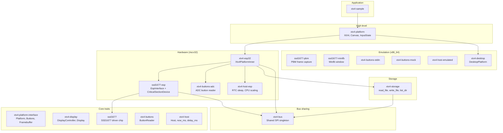

# xtx4-rust-sdk

Rust SDK and emulator for the Xteink X4 e-paper device (ESP32-C3).

## Architecture



### SPI bus sharing

The ESP32-C3 has one usable SPI peripheral (SPI2), shared between the SSD1677
display (CS=GPIO21) and the SD card (CS=GPIO12). The `xtx4-bus` crate holds a
`static Mutex<RefCell<MaybeUninit<Spi>>>` initialized once at boot.

- **Display**: `ssd1677-esp` creates a `CriticalSectionDevice` from the shared
  bus, which automatically manages CS (GPIO21) and serializes access.
- **SD card**: `xtx4-storage` implements `SpiDevice` manually, toggling CS
  (GPIO12) via direct PAC register writes (GPIO12 is not exposed by esp-hal
  on ESP32-C3 as it's normally reserved for flash — the X4 uses DIO flash
  mode which frees this pin).

Both use the same `critical_section::Mutex` for mutual exclusion.

## Crates

| Crate | Description |
|-------|-------------|
| `xtx4-platform-interface` | `Platform` trait, `Buttons`, `Framebuffer`, `Rectangle` |
| `xtx4-display` | `DisplayController` trait + `Display` wrapper |
| `ssd1677` | SSD1677 e-paper driver (controller + register definitions) |
| `xtx4-buttons` | `ButtonReader` trait |
| `xtx4-host` | `Host` struct, `now_ms()` / `delay_ms()` |
| `xtx4-bus` | Shared SPI bus singleton for display + SD card |
| `xtx4-storage` | `Storage`: read, write, list, exists (SD card + desktop) |
| `xtx4-esp32` | ESP32 platform: wires display, buttons, storage, host |
| `xtx4-platform` | High-level `XtX4` struct, canvas rendering, input state |
| `xtx4-sample` | Sample app demonstrating SDK features |
| `ssd1677-esp` | SPI/GPIO transport for SSD1677 (hardware) |
| `ssd1677-pbm` | PBM frame capture for regression testing |
| `ssd1677-minifb` | Minifb window display emulation |
| `xtx4-buttons-adc` | ADC resistor-ladder button reader |
| `xtx4-buttons-stdin` | Terminal keyboard input |
| `xtx4-buttons-mock` | Scripted button sequence for tests |
| `xtx4-buttons-minifb` | Minifb window key input |
| `xtx4-host-esp` | RTC sleep, CPU frequency scaling |
| `xtx4-host-emulated` | Emulated host (now_ms, sleep, exit) |
| `xtx4-desktop` | Desktop framebuffer platform |

## Pin Reference

| Signal      | GPIO |
|-------------|------|
| SCLK        | 8    |
| MOSI        | 10   |
| MISO        | 7    |
| EPD CS      | 21   |
| EPD DC      | 4    |
| EPD RST     | 5    |
| EPD BUSY    | 6    |
| SD CS       | 12   |
| Buttons ADC | 1, 2 |
| Power btn   | 3    |
| Battery ADC | 0    |
| USB detect  | 20   |

## Quick Start

```bash
# Build for ESP32-C3
cargo build-esp

# Flash and monitor
cargo run-esp

# Regression tests (x86_64)
cargo test-regression

# Desktop build
cargo run-desktop

# Storage unit tests
cargo test -p xtx4-storage
```

## Storage API

```rust
let mut device = XtX4::new();

// Write a file
device.storage().write_file("/BOOKS/test.txt", b"hello").unwrap();

// Read it back
let mut buf = [0u8; 512];
let n = device.storage().read_file("/BOOKS/test.txt", &mut buf).unwrap();

// List directory
device.storage().list_dir("/", &mut |name| {
    println!("{name}");
    true
}).unwrap();

// Check existence
assert!(device.storage().exists("/BOOKS/test.txt"));
```

## License

GPL-3.0-or-later
